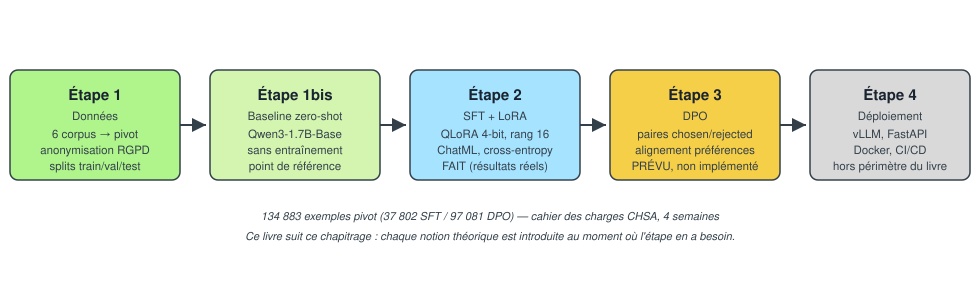
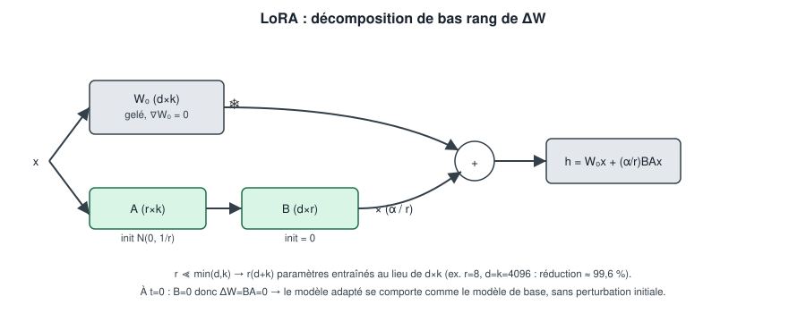
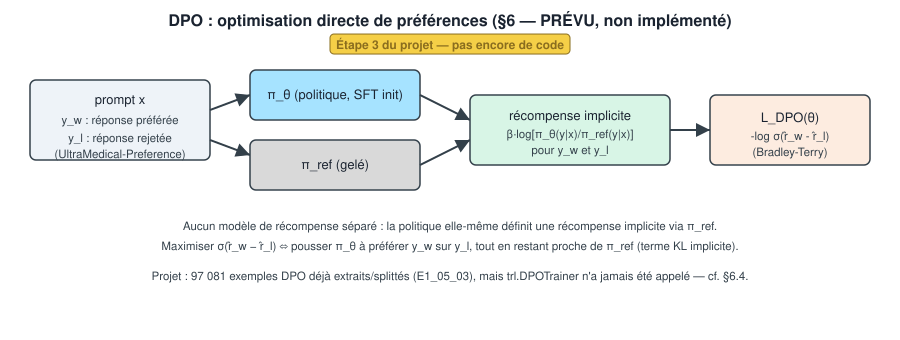

# Livre théorique : fine-tuning de LLM appliqué au triage médical CHSA

*Document pédagogique transversal, rédigé pour accompagner le projet
CHSA Triage. Chaque notion théorique est introduite au moment précis
où le pipeline réel du projet en a besoin, immédiatement suivie de son
application concrète (chiffres mesurés, extraits de code réels
lorsqu'ils existent). Ce n'est pas un cours généraliste sur les LLM :
c'est le compagnon théorique du pipeline `E1_01` → `E2_05` décrit dans
`README.md`.*

**Sources théoriques distillées** : `POST TRAININ 101 RAFAEL.docx`
(RLHF, modèles de récompense, DPO/PPO/GRPO) et
`SUPERVISED FINE TUNING_V2.docx` (SFT, ChatML, LoRA/QLoRA, écosystème
TRL), toutes deux dans ce même dossier. Elles ne sont jamais copiées
intégralement ici : seules les notions directement utiles au pipeline
CHSA sont extraites, reformulées et sourcées. Les formules non issues
de ces deux documents (dérivation de la perte DPO à partir de la
politique optimale sous contrainte KL, notamment) s'appuient sur la
littérature académique établie (Hu et al. 2021, Dettmers et al. 2023,
Rafailov et al. 2023) et sont signalées comme telles, jamais présentées
comme extraites des sources internes.

**Pour la théorie déjà écrite spécifiquement pour l'Étape 2** (public
visé, granularité différente, sans les mathématiques développées ici) :
`docs/03_etape2_sft/00_introduction_concepts.md`. Ce livre complète ce
document, il ne le remplace pas.

---

## Table des matières

1. [Introduction](#1-introduction)
2. [Fondations : LLM décodeur-seul et prédiction du token suivant](#2-fondations--llm-décodeur-seul-et-prédiction-du-token-suivant)
3. [Préparation des données](#3-préparation-des-données)
4. [Évaluation baseline zero-shot](#4-évaluation-baseline-zero-shot)
5. [Fine-tuning supervisé (SFT) et LoRA/QLoRA](#5-fine-tuning-supervisé-sft-et-loraqlora)
6. [Alignement par préférences (DPO) : théorie et application prévue](#6-alignement-par-préférences-dpo--théorie-et-application-prévue)
7. [Fiche récapitulative, glossaire et formulaire](#7-fiche-récapitulative-glossaire-et-formulaire)

---

## 1. Introduction

### 1.1. Contexte et objectif

Le cahier des charges (`docs/00_cadrage/01_cahier_des_charges.md`)
demande, en 4 semaines, un **Proof of Concept** démontrant la
faisabilité d'un agent IA de triage pour le service des urgences du
Centre Hospitalier Saint-Aurélien : classer la priorité clinique selon
l'échelle **ESI** (niveaux 1 à 5), produire une sortie JSON strict avec
un raisonnement explicite, en français et en anglais, sur un modèle
imposé (`Qwen3-1.7B-Base` → `Qwen3-1.7B`), affiné par **SFT + LoRA**
puis aligné par **DPO**. Contrainte matérielle centrale (NF5) :
l'entraînement doit tenir sur le budget d'un seul GPU cloud modeste
(T4/A10/L4, 16-24 Go de VRAM), jamais un cluster multi-GPU.

Ce budget contraint est le fil conducteur de tout ce livre : chaque
choix théorique couvert (LoRA, quantification 4-bit, packing,
`assistant_only_loss`, DPO sans modèle de récompense séparé) est un
choix qui rend un fine-tuning de LLM *possible* dans ce budget, pas
seulement une variante académique parmi d'autres.

### 1.2. Vue d'ensemble du pipeline réel



L'état réel de chaque étape à la date de rédaction (18/09/2026, vérifié
contre `README.md` et `AGENTS.md`) :

| Étape | Statut | Résultat réel |
|---|---|---|
| 1. Données | **Fait** | 134 883 exemples pivot (37 802 SFT / 97 081 DPO), anonymisés, splittés |
| 1bis. Baseline zero-shot | **Fait** | F1 token 0,037 (CPU) / 0,043 (GPU), 278 exemples de test |
| 2. SFT + LoRA | **Fait** | Convergence SAINE, F1 token 0,112 post-SFT (× 2,6 vs meilleure baseline) |
| 3. DPO | **Prévu, non implémenté** | Données prêtes (97 081 paires), aucun code d'entraînement |
| 4. Déploiement (vLLM/FastAPI/Docker) | Hors périmètre de ce livre | (n/a) |

Ce livre suit ce chapitrage dans l'ordre réel du projet, pas l'ordre
pédagogique habituel d'un cours de deep learning : la théorie
mathématique (cross-entropy, LoRA, DPO) n'apparaît qu'au chapitre où le
pipeline en a concrètement besoin.

---

## 2. Fondations : LLM décodeur-seul et prédiction du token suivant

Ce chapitre pose le strict minimum pour comprendre les chapitres 4 à 6 :
ni un cours complet sur l'architecture Transformer, ni une couverture
de l'attention multi-tête. Le décodeur lui-même n'est jamais modifié
dans ce projet (LoRA gèle les poids de base, cf. §5) : ce qu'il faut
comprendre, c'est *ce que le modèle apprend à prédire* et *comment on
mesure son erreur*, car c'est exactement ce que SFT et DPO viennent
changer.

### 2.1. Modèle de langage autoregressif

Un LLM décodeur-seul (GPT, Llama, Qwen) modélise la probabilité d'une
séquence de tokens `X = (x_1, ..., x_N)` comme un produit de
probabilités conditionnelles, chaque token ne dépendant que de ceux qui
le précèdent (contrainte *causale*) :

```
P(X) = Π_{i=1}^{N} P(x_i | x_1, ..., x_{i-1} ; θ)
```

À chaque position `i`, le modèle produit un vecteur de logits
`z_i ∈ ℝ^|V|` (`|V|` = taille du vocabulaire), transformé en
distribution de probabilité par softmax :

```
p_{i,k} = exp(z_{i,k}) / Σ_{j=1}^{|V|} exp(z_{i,j})
```

C'est la même formule, sans altération, que celle du chapitre 1 de
`SUPERVISED FINE TUNING_V2.docx` : elle sert de socle direct à la perte
de cross-entropy du chapitre 5 (§5.1).

### 2.2. Tokenisation

Le texte n'est jamais consommé caractère par caractère : un
*tokenizer* (le plus souvent un algorithme de type Byte-Pair Encoding)
découpe le texte en sous-unités (tokens), chacune associée à un entier
(`input_ids`). Deux tokens spéciaux comptent particulièrement pour la
suite de ce livre : le token de fin de séquence (**EOS**), et les
tokens de contrôle qui délimitent les tours d'une conversation
(`<|im_start|>`, `<|im_end|>` pour le format ChatML utilisé par
`Qwen3-1.7B-Base`, détaillé au §5.4). Un token de contrôle qui n'est
**pas** enregistré comme token spécial dans le vocabulaire se fait
redécouper en fragments de sous-mots ordinaires par le tokenizer,
brisant la structure attendue par l'entraînement : un piège documenté
dans la source (`SUPERVISED FINE TUNING_V2.docx`, §2.4) et directement
pertinent au §5.4 ci-dessous.

### 2.3. Modèle de base vs. modèle "instruct"

`Qwen3-1.7B-Base` (le modèle imposé pour ce projet, cahier des charges
§6) est pré-entraîné uniquement à prédire le token suivant sur
d'énormes volumes de texte générique. Il n'a jamais vu d'exemple
explicite de "voici une question, voici la bonne réponse formatée" : si
on lui envoie une question, sa complétion la plus probable peut tout
aussi bien être une suite de questions similaires (comportement de
continuation de document), pas une réponse. C'est précisément l'écart
que le **SFT** (chapitre 5) vient combler : transformer un modèle qui
*continue du texte* en un modèle qui *répond à une instruction* dans un
format donné.

### 2.4. Ce que ce livre ne couvre pas

L'attention multi-tête, le positionnement (RoPE), les normalisations
(RMSNorm) et le détail du bloc Transformer ne sont jamais modifiés par
ce projet (`W₀` reste un module linéaire opaque du point de vue de
LoRA, §5.3) : leur mécanique interne n'est donc pas développée ici. Le
lecteur qui veut cette profondeur peut consulter directement
`SUPERVISED FINE TUNING_V2.docx` (chapitres 2-4) ou toute référence
standard sur les Transformers.

---

## 3. Préparation des données

### 3.1. Pourquoi anonymiser (théorie brève)

Le cahier des charges impose une anonymisation systématique avant tout
usage en fine-tuning (RGPD art. 5, minimisation des données ; art. 25,
protection dès la conception), même si les corpus sources sont publics
et académiques : c'est une exigence de précaution (NF2), pas une
réaction à un incident constaté. L'outil imposé est **Microsoft
Presidio** (`presidio-analyzer` + `presidio-anonymizer`), qui combine
des modèles NLP (spaCy) pour détecter des entités nommées (personnes,
lieux, dates, contacts) et des *recognizers* à base de règles/regex
pour des identifiants structurés (numéros de téléphone, e-mails, NIR).
Trois stratégies de traitement d'une entité détectée sont possibles :
la **suppression** (`redact`, casse la syntaxe de la phrase), le
**masquage par caractères** (`mask`, ex. `***`), et le **remplacement**
par un jeton générique (`replace`, ex. `<INFO_MASQUEE>`) qui préserve
la lisibilité grammaticale de la phrase, la stratégie retenue pour ce
projet car elle dégrade le moins la qualité des exemples SFT.

### 3.2. Application réelle au projet

Le pipeline réel (`interfaces/cli/E1_01_*` → `E1_05_*`, détail complet
dans `README.md` §1 et `docs/02_etape1_donnees/`) :

**Fusion en schéma pivot.** 6 fichiers sources (MediQAl trois
configurations, FrenchMedMCQA, MedQuAD, UltraMedical-Preference) sont
fusionnés dans un schéma pivot commun (`ExemplePivot`, un couple
`prompt`/`completion` pour les exemples SFT, `prompt`/`chosen`/
`rejected` pour les exemples DPO). Chaque exemple reçoit un
**identifiant déterministe** (hash SHA-256 d'une clé naturelle propre à
sa source), pas un identifiant aléatoire : cela permet de détecter de
vrais doublons entre sources (par exemple entre les configurations
`oeq`/`mcqu` de MediQAl, qui partagent 1 492 identifiants bruts
identiques pour des enregistrements réellement différents). Résultat
réel mesuré : **147 204 enregistrements
bruts fusionnés en 134 883 exemples pivot**, 12 321 doublons exacts
détectés et archivés (jamais perdus) dans
`data/processed/doublons_supprimes.jsonl`.

```python
from dataclasses import dataclass

@dataclass(frozen=True)
class Message:
    role: str       # "system" | "user" | "assistant"
    contenu: str

@dataclass(frozen=True)
class ExemplePivot:
    identifiant: str                       # sha256(espace_noms:cle_naturelle)
    source: str                            # "MediQAl" | "FrenchMedMCQA" | ...
    type_exemple: str                      # "sft" | "dpo"
    langue: str                            # "fr" | "en"
    prompt: tuple[Message, ...] = ()
    completion: tuple[Message, ...] = ()   # renseigné pour un exemple SFT
    chosen: tuple[Message, ...] = ()       # renseigné pour un exemple DPO
    rejected: tuple[Message, ...] = ()
    split: str | None = None               # "train" | "val" | "test"
```

**Anonymisation Presidio (appel réel, simplifié).** Le pipeline traite
le pivot par vagues incrémentales (`--limite`, jamais tout d'un coup :
le débit mesuré est de 130-550 ms par champ de texte, dominé par
l'inférence spaCy), en écrivant dans un fichier **séparé** du pivot
original (jamais réécrit, ce qui permet de comparer avant/après à
volonté) :

```python
from presidio_analyzer import AnalyzerEngine
from presidio_analyzer.nlp_engine import NlpEngineProvider
from presidio_anonymizer import AnonymizerEngine
from presidio_anonymizer.entities import OperatorConfig

fournisseur = NlpEngineProvider(nlp_configuration=configuration_multilangue)
analyzer = AnalyzerEngine(nlp_engine=fournisseur.create_engine())
anonymizer = AnonymizerEngine()

resultats = analyzer.analyze(text=texte, language="fr")  # ou "en"
sortie = anonymizer.anonymize(
    text=texte,
    analyzer_results=resultats,
    operators={"DEFAULT": OperatorConfig("replace", {"new_value": "<INFO_MASQUEE>"})},
)
```

Chiffres réels mesurés sur un échantillon stratifié de 5 000 exemples
(`docs/02_etape1_donnees/01_rapport_rgpd.md` §3) : 65 914 entités
détectées, 92,0 % des exemples portant au moins une entité. Le taux
croît avec la longueur/complexité du texte : 20,0 % pour
FrenchMedMCQA (réponses à une lettre) contre 99,2 % pour
UltraMedical-Preference (réponses longues, souvent avec bibliographie).
L'anonymisation complète des 134 883 exemples a depuis été menée à son
terme par vagues successives.

**Contrôle qualité et révision humaine.** Un contrôle automatique
(regex sans modèle + seconde opinion spaCy) compare systématiquement le
pivot original et le fichier anonymisé pour détecter de la PII
résiduelle ; les cas ambigus passent par une révision humaine
**persistée** (chaque décision `accepté`/`rejeté` est sauvegardée par
candidat, jamais reperdue d'une exécution à l'autre). Un exemple avec
un candidat PII confirmé ou en attente de révision reste exclu du
découpage en splits tant qu'une décision humaine n'existe pas : ce
n'est pas un simple avertissement dans un rapport, c'est un vrai filtre
appliqué avant publication.

**Découpage en splits.** 134 883 exemples anonymisés répartis en
train/val/test, stratifié par `(type_exemple, source)`, de façon
**cumulative** : un exemple déjà assigné à un split n'est jamais
réassigné à une exécution ultérieure, ce qui élimine par construction
tout risque de fuite train/test entre deux vagues successives
d'anonymisation. Résultat réel : 37 802 exemples SFT / 97 081 exemples
DPO répartis et vérifiés représentatifs par strate.

---

## 4. Évaluation baseline zero-shot

### 4.1. Pourquoi un point zéro (théorie brève)

Avant tout entraînement, il faut une mesure de référence : sans elle,
"le SFT a-t-il amélioré le modèle ?" reste une question sans réponse
chiffrée. Le protocole classique est le **zero-shot** : évaluer le
modèle de base tel quel, sans aucun exemple ni entraînement
supplémentaire, sur le jeu de test déjà isolé (jamais vu à
l'entraînement, cf. §3.2). Deux métriques texte-à-texte simples et sans
dépendance à un schéma de sortie supposé sont utilisées :

- **Exact Match (EM)** : proportion de paires `(généré, référence)`
  strictement identiques après normalisation (minuscules, ponctuation
  retirée, espaces réduits).
- **F1 au niveau token** (même principe que le F1 SQuAD) : moyenne
  harmonique de précision et rappel calculés sur le multi-ensemble de
  tokens communs entre texte généré et texte de référence, après la
  même normalisation.

```python
from collections import Counter

def score_f1_tokens(genere: str, reference: str) -> float:
    tokens_generes = normaliser_texte(genere).split()
    tokens_reference = normaliser_texte(reference).split()
    if not tokens_generes and not tokens_reference:
        return 1.0
    if not tokens_generes or not tokens_reference:
        return 0.0
    communs = Counter(tokens_generes) & Counter(tokens_reference)
    nombre_communs = sum(communs.values())
    if nombre_communs == 0:
        return 0.0
    precision = nombre_communs / len(tokens_generes)
    rappel = nombre_communs / len(tokens_reference)
    return 2 * precision * rappel / (precision + rappel)
```

*(extrait réel, simplifié, de
`src/chsa_triage/application/metriques_evaluation_baseline.py`)*

L'accuracy de classification ESI (niveau 1-5, exigence F2/F3 du cahier
des charges) est aussi implémentée (`exactitude_classification_niveau`,
en extrayant un champ JSON `niveau`), mais n'est **pas** encore
calculable sur le dataset réel : les `completion` actuels (MediQAl,
FrenchMedMCQA, MedQuAD) sont des réponses en langage naturel, pas
encore au format JSON `{niveau, categorie, ressources_estimees}` visé
par le cahier des charges. C'est un écart réel et documenté entre les
données disponibles aujourd'hui et le format de sortie final, pas une
métrique cassée.

### 4.2. Application réelle : deux baselines mesurées

Deux mesures indépendantes de `Qwen3-1.7B-Base`, **sans entraînement**,
sur le même sous-ensemble de 278 exemples `split=test` : CPU quantifié
Q4_K_M via `llama.cpp`, et GPU pleine précision bf16 via `transformers`
sur HF Jobs, pour ne jamais mélanger l'effet de la quantification avec
l'effet réel du SFT mesuré au chapitre 5.

| | Exact match | F1 moyen (token) | Latence moyenne | Échecs d'inférence |
|---|---|---|---|---|
| CPU (Q4_K_M) | 0,000 | 0,037 | ~21,6 s | 36/278 |
| GPU (bf16) | 0,000 | 0,043 | ~7,3 s | 0/278 |

La baseline GPU est plus rapide, plus fiable (zéro échec) et
légèrement meilleure en F1. L'exact match à 0,000 sur les deux runs
n'est pas une anomalie : la métrique exige une correspondance
caractère-à-caractère avec une réponse de référence en langage libre,
un seuil que même un bon générateur en langage naturel franchit
rarement. Ces deux points zéro servent de référence directe pour juger
l'effet du SFT (§5.6).

---

## 5. Fine-tuning supervisé (SFT) et LoRA/QLoRA

### 5.1. Perte de cross-entropy au niveau token, teacher forcing

Le SFT est un ajustement **supervisé** : chaque exemple a une réponse
correcte connue à l'avance (contrairement au DPO du chapitre 6, qui
compare deux réponses sans qu'aucune ne soit "la vérité absolue"). Sur
la formulation autoregressive posée au §2.1, l'objectif d'entraînement
est de maximiser la vraisemblance, ou de façon équivalente, de
minimiser le **log-vraisemblance négatif** (NLL) moyen sur une séquence
de longueur `N` :

```
L_NLL(θ) = -(1/N) Σ_{i=1}^{N} log P(x_i | x_{<i} ; θ)
```

qui, combiné à la formule softmax du §2.1, s'écrit en pratique comme
une **cross-entropy** entre les logits `z_i` et le token cible
`y_i` :

```
L_cross-entropy = -log p_{i,y_i} = -z_{i,y_i} + log Σ_{j=1}^{|V|} exp(z_{i,j})
```

Concrètement, entraîner un modèle causal, c'est lui montrer la
séquence complète (prompt **et** réponse) en une seule passe et calculer
une perte à chaque position simultanément : c'est le **teacher
forcing**, le modèle ne génère jamais réellement pendant
l'entraînement, il est toujours "corrigé" par le vrai token suivant
plutôt que par sa propre prédiction précédente. C'est ce qui rend
l'entraînement parallélisable sur toute la séquence en une seule passe
avant, plutôt que token par token comme à l'inférence.

**Décalage d'un token et masquage (`ignore_index = -100`).** Le modèle
ne doit jamais prédire le token qu'il est en train de lire, mais le
suivant : `input_ids` et `labels` sont donc décalés d'une position
l'un par rapport à l'autre. `torch.nn.CrossEntropyLoss` traite par
convention la valeur `-100` comme "ignorer cette position" (perte
nulle, aucun gradient) : c'est exactement le mécanisme qui permet de
masquer sélectivement certaines parties de la séquence, utilisé plus
bas pour l'`assistant_only_loss` (§5.4).

### 5.2. PEFT complet vs. fine-tuning complet : le calcul mémoire

Un fine-tuning **complet** ("full fine-tuning") met à jour la totalité
des `Θ` paramètres du modèle. Pour un entraînement avec l'optimiseur
AdamW en précision mixte, la mémoire minimale requise (hors
activations) se décompose comme :

| Composant | Coût |
|---|---|
| Poids (bf16/fp16) | 2Θ octets |
| Gradients (bf16/fp16) | 2Θ octets |
| États AdamW (1er/2e moment + copie maître fp32) | 12Θ octets |
| **Total minimum** | **16Θ octets** |

Appliqué à `Qwen3-1.7B` (`Θ ≈ 1,7 × 10⁹`) : `16 × 1,7 × 10⁹ ≈ 27 Go`,
rien que pour les poids, gradients et états de l'optimiseur, **avant**
de compter les activations. C'est déjà proche ou au-delà de la VRAM
d'un GPU cloud unique visé par le cahier des charges (NF5, T4/A10/L4,
16-24 Go) : le full fine-tuning n'est donc pas seulement coûteux ici,
il est concrètement hors de portée du budget matériel du POC.

### 5.3. Hypothèse de dimension intrinsèque et LoRA

Aghajanyan et al. (2020) ont montré que, bien que les LLM soient
paramétrés dans un espace de dimension `D` très élevée, l'optimisation
réussie d'une tâche spécifique se déroule en réalité dans un
sous-espace de dimension intrinsèque `d ≪ D` bien plus petit :
l'adaptation à une nouvelle tâche n'a pas besoin de degrés de liberté
indépendants dans chacune des `D` dimensions du modèle.

**LoRA** (Hu et al., 2021, *Low-Rank Adaptation of Large Language
Models*) exploite directement cette hypothèse. Pour un module linéaire
donné (par exemple une projection d'attention), la transformation
standard sur une entrée `x ∈ ℝ^k` s'écrit `h = W₀x` avec
`W₀ ∈ ℝ^{d×k}`. Un ajustement complet chercherait une matrice dense
`ΔW ∈ ℝ^{d×k}` telle que `h = (W₀ + ΔW)x`. LoRA **gèle** `W₀`
(`∇W₀ = 0`) et **décompose** `ΔW` en un produit de deux matrices de bas
rang :

```
ΔW = BA,   A ∈ ℝ^{r×k},   B ∈ ℝ^{d×r},   r ≪ min(d, k)
h  = W₀x + (α/r) · BAx
```



**Initialisation et stabilité.** `A` est initialisée aléatoirement
(`A ∼ N(0, 1/r)`), `B` est initialisée **à zéro**. Conséquence directe :
au pas d'optimisation `t=0`, `ΔW = BA = 0`, donc `h = W₀x` : le modèle
adapté se comporte exactement comme le modèle de base avant que le
moindre gradient n'ait mis à jour l'adaptateur, sans injecter de bruit
numérique au démarrage.

**Facteur d'échelle `α`.** La sortie de la branche adaptateur est
multipliée par la constante `α/r`. Garder le rapport `α/r` constant
(ou `α` fixe) quand on fait varier `r` évite d'avoir à réajuster le
taux d'apprentissage entre deux expériences : `α` régule la magnitude
effective du gradient injecté par l'adaptateur, indépendamment de `r`.

**Réduction paramétrique.** Exemple illustratif tiré de la source (pas
les dimensions réelles de `Qwen3-1.7B`, non vérifiées ici) : pour
`d = k = 4096`, une matrice dense `ΔW` compte `4096 × 4096 ≈ 16,7 M`
paramètres ; avec `r = 8`, LoRA n'en entraîne que
`r(d+k) = 8 × 8192 = 65 536`, soit une réduction d'environ 99,6 %. Ce
qui compte pour ce projet n'est pas ce chiffre précis (propre à cet
exemple), mais l'ordre de grandeur qu'il illustre : les paramètres
LoRA effectivement entraînés représentent, sur l'ensemble du modèle,
de l'ordre de 0,1 à 1 % du total (chiffre vérifié dans
`docs/03_etape2_sft/00_introduction_concepts.md` pour ce projet) : plus
besoin de gradient ni d'état d'optimiseur AdamW pour les ~99 % de poids
restés gelés.

### 5.4. Quantification 4-bit et QLoRA

Même en LoRA, les poids gelés `W₀` doivent rester chargés en mémoire.
**QLoRA** (Dettmers et al., 2023) combine LoRA avec le chargement du
modèle de base en 4-bit, réduisant son empreinte d'environ 4×
(`Qwen3-1.7B` : ≈ 3,4 Go en bf16 contre ≈ 0,9 Go en 4-bit). Les poids
d'un réseau entraîné suivent empiriquement une loi approximativement
normale centrée en zéro (`W ∼ N(0, σ²)`) : le format
**NF4** (*NormalFloat 4-bit*) construit ses 16 niveaux de quantisation
`q_i` en répartissant les quantiles d'une loi normale plutôt qu'un pas
linéaire uniforme, de façon à ce que chacun des `2⁴ = 16` intervalles
contienne, en espérance, le même nombre de paramètres :

```
q_i = Q_X(i / 16) / max_j |Q_X(j / 16)|
```

où `Q_X` est la fonction quantile (CDF inverse) de la loi normale
standard `N(0,1)`. Ce format est théoriquement optimal pour des poids
distribués normalement : il minimise l'erreur de quantification là où
la masse de probabilité est réellement concentrée, contrairement à une
quantification entière uniforme (Int4) qui gaspille des niveaux dans
les queues de distribution peu peuplées.

QLoRA ajoute deux optimisations complémentaires : la **double
quantification** (quantifier aussi les constantes d'échelle utilisées
pour reconvertir les poids 4-bit en flottants, réduisant leur surcoût
de ≈ 0,5 à ≈ 0,127 bit/paramètre), et les **optimiseurs paginés**
(mémoire CUDA unifiée GPU/CPU, qui évite les erreurs `Out of Memory`
lors de pics ponctuels d'usage VRAM en repoussant temporairement des
états d'optimiseur vers la RAM).

### 5.5. ChatML, `apply_chat_template` et `assistant_only_loss`

**ChatML** sérialise une conversation multi-tours (system/user/
assistant) en un flux de texte unique, délimité par des tokens de
contrôle (`<|im_start|>role ... <|im_end|>`), le format que
`Qwen3-1.7B-Base` reconnaît nativement via son *chat template* (gabarit
Jinja embarqué dans le tokenizer). `tokenizer.apply_chat_template`
l'applique automatiquement à partir d'une liste de dictionnaires
`{role, content}`, avec `add_generation_prompt=False` à l'entraînement
(on montre une conversation déjà complète) et `add_generation_prompt=
True` à l'inférence (on ne montre que le prompt, le modèle doit
générer la suite).

Par défaut, la perte de cross-entropy se calcule sur **tous** les
tokens de la séquence, y compris ceux du prompt : le modèle "apprend"
alors aussi à prédire la question elle-même, un signal inutile
puisqu'il n'aura jamais à la générer. **`assistant_only_loss`**
(argument de `trl.SFTConfig`) masque (`-100`, cf. §5.1) tout ce qui
n'est pas un token de la réponse de l'assistant : seul le texte que le
modèle doit effectivement apprendre à produire contribue au gradient.

**Limite réelle rencontrée sur ce projet.** `assistant_only_loss=True`
exige que `trl` reconnaisse le dataset comme *conversationnel*
(structure `messages`, pas un texte déjà rendu). Or `ExempleFormate`
(la sortie de `ChatMLFormateurAdapter`) porte une chaîne ChatML
**pré-rendue** dans un unique champ `texte`, pas une structure
`messages` : `trl.data_utils.is_conversational` renvoie donc `False`
sur ce format, et `assistant_only_loss=True` lève une `ValueError`
plutôt que de s'appliquer silencieusement à moitié. L'entraînement réel
documenté ci-dessous a donc été lancé avec `assistant_only_loss=False`
(perte pleine séquence), un compromis assumé et documenté, pas un bug
silencieux : masquer la perte au texte de l'assistant seul resterait à
implémenter en faisant porter `ExempleFormate` une structure de
messages plutôt qu'un texte pré-rendu, un point ouvert du projet.

### 5.6. Application réelle : recette, entraînement, résultat

**Recette réelle** (`recipes/sft_qwen3_lora.yaml`) :

```yaml
modele_base: Qwen/Qwen3-1.7B-Base

quantification:
  bits: 4
  type_quantification: nf4
  double_quantification: true
  dtype_calcul: bfloat16

lora:
  rang: 16
  alpha: 32
  dropout: 0.05
  modules_cibles: [q_proj, k_proj, v_proj, o_proj]

entrainement:
  taux_apprentissage: 2.0e-4
  nombre_epoques: 3
  taille_lot: 4
  packing: true
  type_perte: nll
  assistant_only_loss: true   # surchargé à false au lancement réel, cf. §5.5
```

**Appel `trl`/`peft` réel** (extrait simplifié de
`infrastructure/adapters/trl_sft_entraineur.py`, sans le port/adaptateur
qui l'entoure) :

```python
from transformers import AutoModelForCausalLM, AutoTokenizer, BitsAndBytesConfig
from peft import LoraConfig, TaskType
from trl import SFTConfig, SFTTrainer

bnb_config = BitsAndBytesConfig(
    load_in_4bit=True,
    bnb_4bit_quant_type="nf4",
    bnb_4bit_use_double_quant=True,
    bnb_4bit_compute_dtype=torch.bfloat16,
)
modele = AutoModelForCausalLM.from_pretrained(
    "Qwen/Qwen3-1.7B-Base", quantization_config=bnb_config
)
tokenizer = AutoTokenizer.from_pretrained("Qwen/Qwen3-1.7B-Base")

lora_config = LoraConfig(
    r=16, lora_alpha=32, lora_dropout=0.05,
    target_modules=["q_proj", "k_proj", "v_proj", "o_proj"],
    task_type=TaskType.CAUSAL_LM,
)
sft_config = SFTConfig(
    output_dir="run-sft",
    learning_rate=2e-4,
    num_train_epochs=3,
    per_device_train_batch_size=4,
    packing=True,
    loss_type="nll",
    assistant_only_loss=False,   # cf. §5.5 : limite réelle rencontrée
    eval_strategy="epoch",
)
trainer = SFTTrainer(
    model=modele, args=sft_config,
    train_dataset=dataset_train,       # colonne "text" = ChatML pré-rendu
    eval_dataset=dataset_validation,
    processing_class=tokenizer,
    peft_config=lora_config,
)
trainer.train()
```

**`type_perte: nll` plutôt que `chunked_nll`.** `chunked_nll` calcule
la cross-entropy par sous-blocs de la séquence plutôt que de
matérialiser d'un coup le tenseur de logits complet
(longueur de séquence × taille du vocabulaire, souvent le plus gros
tenseur intermédiaire d'un forward pass LLM), réduisant le pic mémoire.
Un job GPU réel, facturé, a échoué à la construction de `SFTTrainer`
avec `chunked_nll` : la dépendance `unsloth` de l'extra `remote`
(non câblée dans le code) plafonne `trl` à la version `0.24.0` dès
qu'une résolution fraîche a lieu (`hf jobs uv run` ne réutilise pas le
`uv.lock` local), une version de `trl` antérieure au support de
`chunked_nll`. `nll` (cross-entropy standard) fonctionne sur les deux
versions et a donc été retenu.

**Résultat réel.** Le premier entraînement complet a été mené à son
terme avec succès sur un GPU cloud L4 : **~20 minutes, 342 pas, 3
époques, verdict de convergence SAINE**, poids LoRA publiés durablement
sur un dépôt Hugging Face dédié (`mombasstic/chsa-triage-sft-lora`). La
grille de secours (3 taux d'apprentissage × 3 rangs, Optuna
explicitement écarté pour ce POC) n'a jamais été déclenchée : la
convergence a été saine dès le premier essai.

Évaluation post-SFT, mêmes 278 exemples de test et mêmes métriques que
la baseline (§4.2), via le modèle réellement entraîné (base + poids
LoRA) :

| | Exact match | F1 moyen (token) | Latence moyenne |
|---|---|---|---|
| Baseline CPU (Q4_K_M) | 0,000 | 0,037 | ~21,6 s |
| Baseline GPU (bf16) | 0,000 | 0,043 | ~7,3 s |
| **Post-SFT (bf16 + LoRA)** | 0,000 | **0,112** | ~11,6 s |

Le F1 token **quasi triple** par rapport à la meilleure baseline
(0,043 → 0,112) : la première preuve chiffrée que le SFT a un effet
mesurable sur ce projet, cohérente avec le verdict de convergence
SAINE. L'exact match reste à 0,000 sur les trois runs, pour la même
raison qu'au §4.2 (réponses en langage libre, pas de correspondance
caractère-à-caractère attendue).

---

## 6. Alignement par préférences (DPO) : théorie et application prévue

> **Statut réel du projet (18/09/2026) : Étape 3 non implémentée.**
> Aucun script d'entraînement DPO n'existe dans le code à ce jour
> (`README.md`, tableau récapitulatif, Étape 3 : *"aucun script à ce
> jour"*). Les données sont en revanche prêtes : 97 081 exemples DPO
> déjà extraits et splittés (§3.2), un sous-ensemble déjà publié comme
> jeu de données Hugging Face
> (`docs/02_etape1_donnees/dataset_card_dpo_hf.md`). Ce chapitre est
> donc entièrement **théorique et prospectif** : il décrit ce que le
> cahier des charges prévoit, pas ce qui a été exécuté.

### 6.1. RLHF, modèles de récompense et le problème que DPO contourne

L'approche historique d'alignement par préférences, popularisée par
InstructGPT (OpenAI), est le **RLHF** (*Reinforcement Learning from
Human Feedback*) : entraîner un **modèle de récompense** (RM) séparé à
partir de comparaisons humaines pairwise, puis optimiser la politique
(le LLM) par un algorithme de RL (le plus souvent PPO) pour maximiser
la récompense prédite par ce RM, tout en restant proche d'un modèle de
référence via une pénalité de divergence KL :

```
max_π  E_{y ~ π(·|x)} [ r(x,y) ] − β · KL( π(·|x) ‖ π_ref(·|x) )
```

Le terme KL empêche la politique de "s'échapper" trop loin du modèle
de référence (ici, le modèle post-SFT) pour exploiter les failles du
modèle de récompense, un phénomène connu sous le nom de *reward
hacking*. Ce pipeline en deux temps (entraîner un RM, puis faire du RL
dessus) est puissant mais lourd : deux modèles à entraîner et à faire
tenir en mémoire, une boucle RL notoirement instable à régler.

### 6.2. Modèle de préférence de Bradley-Terry

Le RM standard s'appuie sur le **modèle de Bradley-Terry**, qui donne
la probabilité qu'une réponse `y_1` soit préférée à une réponse `y_2`
pour un même prompt `x`, en fonction d'un score scalaire `r_θ` :

```
P(y_1 > y_2) = exp(r_θ(x,y_1)) / [ exp(r_θ(x,y_1)) + exp(r_θ(x,y_2)) ]
```

En maximisant la log-vraisemblance de ce modèle sur des paires
étiquetées `(x, y_w, y_l)` (`y_w` préférée, `y_l` rejetée), on obtient
la perte d'entraînement du RM :

```
L_RM(θ) = -E [ log σ( r_θ(x,y_w) − r_θ(x,y_l) ) ]
```

où `σ` est la fonction sigmoïde. C'est cette même structure
(sigmoïde d'une différence de scores) que DPO réutilise directement,
sans jamais entraîner de `r_θ` séparé (§6.3).

### 6.3. De la politique optimale sous contrainte KL à la perte DPO

**Dérivation** (littérature académique établie, Rafailov et al. 2023 ;
non extraite des deux sources internes, qui citent le résultat final
sans le dériver, cf. `SUPERVISED FINE TUNING_V2.docx`). Pour un
`r(x,y)` fixé, l'objectif KL-régularisé du §6.1 admet une solution
analytique en forme close :

```
π*(y|x) = (1/Z(x)) · π_ref(y|x) · exp( r(x,y) / β )
```

où `Z(x)` est une constante de normalisation ne dépendant que de `x`.
En inversant cette relation, la récompense implicite d'une politique
`π` s'exprime uniquement en fonction de `π`, de `π_ref` et de `β` :

```
r(x,y) = β · log( π(y|x) / π_ref(y|x) ) + β · log Z(x)
```

Le terme `β log Z(x)` s'annule dans la différence
`r(x,y_w) − r(x,y_l)` (il ne dépend que de `x`, identique pour les deux
réponses). En substituant cette récompense implicite dans la perte
Bradley-Terry du §6.2, on obtient directement la perte **DPO**
(formule confirmée telle quelle dans `SUPERVISED FINE TUNING_V2.docx`) :

```
L_DPO(θ; π_ref) = -E_{(x,y_w,y_l)} [
    log σ( β·log(π_θ(y_w|x)/π_ref(y_w|x)) − β·log(π_θ(y_l|x)/π_ref(y_l|x)) )
]
```



Ce qui rend DPO attractif pour un POC à budget contraint est exactement
ce que cette dérivation rend visible : **aucun modèle de récompense
séparé n'est jamais entraîné**. La récompense reste implicite, portée
directement par le rapport de vraisemblance entre la politique en cours
d'entraînement et une copie gelée du modèle de référence (ici, le
checkpoint post-SFT du chapitre 5). C'est un entraînement supervisé
classique (perte scalaire, pas de rollout ni d'échantillonnage comme en
PPO), *off-policy* sur des paires de préférence fixées à l'avance :
plus stable, moins cher à faire tourner qu'une boucle PPO complète, une
propriété directement citée dans les deux sources internes comme la
raison de son adoption largement répandue pour ce type de projet.

### 6.4. Ce que l'application au projet impliquerait

Avec `trl.DPOTrainer`, l'appel suivrait le même schéma que
`SFTTrainer` (squelette illustratif, jamais exécuté sur ce projet,
construit à partir de l'API `trl` documentée) :

```python
from trl import DPOConfig, DPOTrainer

dpo_config = DPOConfig(
    output_dir="run-dpo",
    beta=0.1,                         # poids de la régularisation KL implicite
    learning_rate=5e-6,               # ordre de grandeur usuel, nettement < SFT
)
trainer = DPOTrainer(
    model=modele_post_sft,            # initialisé depuis le checkpoint LoRA du chapitre 5
    ref_model=None,                   # None : trl dérive π_ref du même modèle avant entraînement
    args=dpo_config,
    train_dataset=dataset_dpo,        # colonnes "prompt" / "chosen" / "rejected"
    processing_class=tokenizer,
    peft_config=lora_config,          # même schéma QLoRA que le SFT, cf. §5.4
)
trainer.train()
```

Deux points restent, à ce jour, des décisions ouvertes plutôt que des
faits établis pour ce projet : (1) le point de départ naturel de `π_θ`
et `π_ref` serait le checkpoint SFT du chapitre 5, jamais vérifié en
pratique ; (2) le budget GPU (NF5) qui a déjà contraint le choix de
QLoRA pour le SFT s'appliquerait identiquement au DPO, avec en plus un
second passage avant (le modèle de référence gelé) à faire tenir en
mémoire simultanément, un point de vigilance mémoire spécifique au DPO
qui n'a, lui non plus, jamais été vérifié empiriquement sur ce projet.

---

## 7. Fiche récapitulative, glossaire et formulaire

### 7.1. Formulaire

| Notion | Formule | Chapitre |
|---|---|---|
| Probabilité d'une séquence (autoregressif) | `P(X) = Π_i P(x_i|x_{<i};θ)` | §2.1 |
| Softmax sur les logits | `p_{i,k} = exp(z_{i,k}) / Σ_j exp(z_{i,j})` | §2.1 |
| Perte NLL moyenne | `L_NLL = -(1/N) Σ_i log P(x_i|x_{<i};θ)` | §5.1 |
| Cross-entropy par token | `L = -z_{i,y_i} + log Σ_j exp(z_{i,j})` | §5.1 |
| Mémoire full fine-tuning (AdamW, bf16) | `16Θ` octets (hors activations) | §5.2 |
| Reparamétrisation LoRA | `ΔW = BA`, `h = W₀x + (α/r)BAx` | §5.3 |
| Condition de rang LoRA | `r ≪ min(d,k)` | §5.3 |
| Niveaux de quantisation NF4 | `q_i = Q_X(i/16) / max_j |Q_X(j/16)|` | §5.4 |
| Préférence de Bradley-Terry | `P(y1>y2) = exp(r(y1)) / [exp(r(y1))+exp(r(y2))]` | §6.2 |
| Perte du modèle de récompense | `L_RM = -E[log σ(r_θ(x,y_w)-r_θ(x,y_l))]` | §6.2 |
| Perte DPO | `L_DPO = -E[log σ(β·log(π_θ(y_w|x)/π_ref(y_w|x)) - β·log(π_θ(y_l|x)/π_ref(y_l|x)))]` | §6.3 |

### 7.2. Glossaire

- **Assistant-only loss** : masquage de la perte de cross-entropy sur
  tous les tokens sauf ceux de la réponse de l'assistant (§5.1, §5.5).
- **Bradley-Terry** : modèle probabiliste classique de comparaison
  pairwise, base mathématique des modèles de récompense RLHF (§6.2).
- **ChatML** : format de sérialisation d'une conversation multi-tours
  en un flux de texte avec tokens de contrôle (§5.5).
- **DPO (Direct Preference Optimization)** : alignement par préférences
  sans modèle de récompense séparé, perte dérivée directement de la
  politique optimale sous contrainte KL (§6.3).
- **EM / F1 token** : métriques texte-à-texte de comparaison
  généré/référence, utilisées comme baseline avant tout schéma de
  sortie structuré (§4.1).
- **ESI (Emergency Severity Index)** : échelle de triage clinique en 5
  niveaux, cible de classification du cahier des charges (§1.1, §4.1).
- **NF4 (NormalFloat 4-bit)** : type de quantification 4-bit optimisé
  pour des poids distribués normalement (§5.4).
- **NLL (Negative Log-Likelihood)** : log-vraisemblance négative,
  objectif minimisé à l'entraînement d'un modèle autoregressif (§5.1).
- **Packing** : concaténation de plusieurs exemples courts dans une
  même séquence d'entraînement pour réduire le padding (cf.
  `docs/03_etape2_sft/00_introduction_concepts.md` §5).
- **PEFT (Parameter-Efficient Fine-Tuning)** : famille de techniques
  qui n'entraînent qu'une petite fraction des paramètres d'un modèle
  (§5.3).
- **QLoRA** : combinaison de LoRA avec un modèle de base chargé en
  4-bit (§5.4).
- **RGPD** : Règlement Général sur la Protection des Données, cadre
  légal imposant l'anonymisation du pipeline (§3.1).
- **RLHF (Reinforcement Learning from Human Feedback)** : alignement
  par RL à partir d'un modèle de récompense entraîné sur des
  préférences humaines (§6.1).
- **SFT (Supervised Fine-Tuning)** : ajustement supervisé d'un modèle
  de base sur des paires instruction-réponse (§5.1).
- **Teacher forcing** : entraînement où le modèle reçoit toujours le
  vrai token précédent, jamais sa propre prédiction (§5.1).
- **Zero-shot** : évaluation d'un modèle sans aucun exemple ni
  entraînement supplémentaire (§4.1).

### 7.3. Où trouver la suite

- Détail d'implémentation et notes techniques transversales :
  `AGENTS.md` (racine du dépôt).
- Commandes réelles, exécutées, résultat par résultat :
  `README.md`.
- Théorie complémentaire spécifique à l'Étape 2 (packing, grad norm,
  optimisations Unsloth/Liger/FlashAttention-2) :
  `docs/03_etape2_sft/00_introduction_concepts.md`.
- Méthodologie RGPD complète (recognizers personnalisés, normalisation
  des âges, révision humaine persistée) :
  `docs/02_etape1_donnees/01_rapport_rgpd.md`.
- Sources théoriques intégrales : `POST TRAININ 101 RAFAEL.docx`,
  `SUPERVISED FINE TUNING_V2.docx` (ce même dossier).

### 7.4. Références académiques citées

- Hu, E. J., Shen, Y., Wallis, P., et al. (2021). *LoRA: Low-Rank
  Adaptation of Large Language Models*. arXiv:2106.09685.
- Dettmers, T., Pagnoni, A., Holtzman, A., Zettlemoyer, L. (2023).
  *QLoRA: Efficient Finetuning of Quantized LLMs*. arXiv:2305.14314.
- Aghajanyan, A., Zettlemoyer, L., Gupta, S. (2020). *Intrinsic
  Dimensionality Explains the Effectiveness of Language Model
  Fine-Tuning*. arXiv:2012.13255.
- Rafailov, R., Sharma, A., Mitchell, E., et al. (2023). *Direct
  Preference Optimization: Your Language Model is Secretly a Reward
  Model*. arXiv:2305.18290.
- Ouyang, L., Wu, J., Jiang, X., et al. (2022). *Training language
  models to follow instructions with human feedback* (InstructGPT).
  arXiv:2203.02155.
